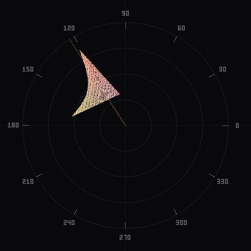
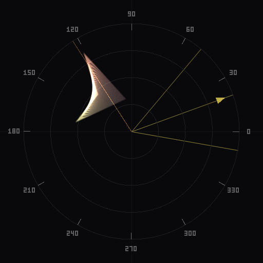

# Chromascope

Real-time chrominance vectorscope for Adobe Photoshop and Lightroom Classic. Analyze color distribution, overlay harmony zones, and visualize density -- all inside your editing workflow.

**[Website](https://kevinkiklee.github.io/chromascope/)** · **[Download](https://kevinkiklee.github.io/chromascope/download/)** · **[Documentation](https://kevinkiklee.github.io/chromascope/docs/)**

## What it does

Chromascope maps every pixel in your image onto a circular vectorscope plot, showing where your colors live in chrominance space. Use it to:

- Spot color casts and imbalances at a glance
- Check skin tones against the industry-standard reference line
- Overlay harmony zones (complementary, triadic, analogous, etc.) and rotate them to find the right grade
- Toggle scatter and bloom density modes for different levels of detail

Works as a native panel in Photoshop (UXP) and as a floating dialog in Lightroom Classic, updating in real time as you adjust develop sliders.

### Density modes

Two visualization modes show chrominance distribution at different levels of detail:

<p align="center">
  
  
</p>
<p align="center">
  <b>Scatter</b> · individual pixel dots &nbsp;&nbsp;&nbsp;&nbsp;&nbsp;
  <b>Bloom</b> · radial glow with additive blending
</p>

### Harmony overlays

Overlay color harmony zones on the vectorscope to guide your grading decisions. Rotate the zones interactively to find the best fit for your image.

<p align="center">
  
</p>

## Quick start

```sh
git clone https://github.com/kevinkiklee/chromascope.git
cd chromascope
./scripts/setup.sh
```

This installs dependencies, builds all packages, compiles the Rust binary, and runs tests. See [docs/SETUP.md](docs/SETUP.md) for prerequisites and manual setup.

### Development

```sh
npx turbo dev              # Start all dev servers
cd packages/core && npm run dev   # Core library only (Vite)
```

### Build plugins for distribution

```sh
npm run build:plugins
```

Builds the core library, compiles the Rust processor for all platforms, assembles the Photoshop and Lightroom plugins.

## How it works

### Photoshop (UXP)

The core library bundles to a single HTML file that runs inside the UXP panel WebView. The plugin reads pixel data via the Imaging API and sends it to the core for rendering. Edits flow back through a typed message protocol.

```
Photoshop  --PixelsMessage-->  Core WebView (vectorscope)
Photoshop  <--EditMessage---   Core WebView (color correction)
```

### Lightroom Classic (Lua + Rust)

Lightroom's Lua SDK can't embed WebViews or access pixel data directly. Instead, the Rust `processor` binary handles everything outside Lua's reach:

```
LrC plugin
  1. requestJpegThumbnail  -->  JPEG from catalog
  2. processor decode      -->  raw RGB bytes
  3. processor render      -->  vectorscope JPEG
  4. f:picture             -->  display in dialog
```

The scope updates automatically by polling `getDevelopSettings()` every 500ms and hashing the full table with a recursive djb2 fingerprint. This detects changes in any develop panel — Basic, HSL, Masking, Calibration, Detail, Lens Corrections, Transform, Effects, and more. A busy-guard with coalescing prevents overlapping renders, and frame alternation between two output files forces Lightroom to release cached images (preventing memory leaks).

### Processor binary

The `processor` CLI has two subcommands:

| Command | Purpose |
|---------|---------|
| `processor decode` | Decode JPEG/TIFF to raw RGB, resized to target dimensions |
| `processor render` | Render a vectorscope JPEG from raw RGB data |

Render options: `--density` (scatter, bloom), `--scheme` (complementary, triadic, etc.), `--rotation`, `--overlay-color`, `--hide-skin-tone`.

## Project structure

```
packages/core/        TypeScript vectorscope engine (math, rendering, UI)
packages/processor/   Rust CLI (image decode + vectorscope render)
plugins/photoshop/    Photoshop UXP panel plugin
plugins/lightroom/    Lightroom Classic plugin (Lua + Rust binary)
web/                  Static marketing site + documentation
scripts/              Build and setup automation
```

### Tech stack

| | |
|---|---|
| **Monorepo** | Turborepo |
| **Core** | TypeScript, Vite 6, Vitest, Canvas 2D |
| **Processor** | Rust, image crate, clap |
| **Photoshop** | Adobe UXP, batchPlay, Imaging API |
| **Lightroom** | Lua, LrDevelopController, LrTasks |
| **Web** | Static HTML, Tailwind CSS via CDN |

### Build order

```
packages/core -----> plugins/photoshop  (embeds built HTML)
                +--> plugins/lightroom  (embeds built HTML)

packages/processor -> plugins/lightroom  (binary copied to bin/<platform>/)

web                  (independent)
```

## Contributing

See [docs/CONTRIBUTING.md](docs/CONTRIBUTING.md) for development workflow, commit conventions, and architecture notes.

## License

MIT. See [LICENSE](LICENSE) for details.
